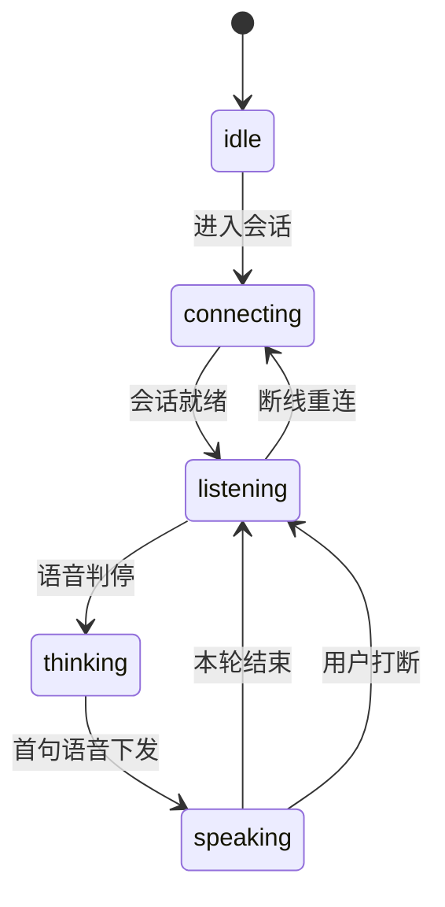
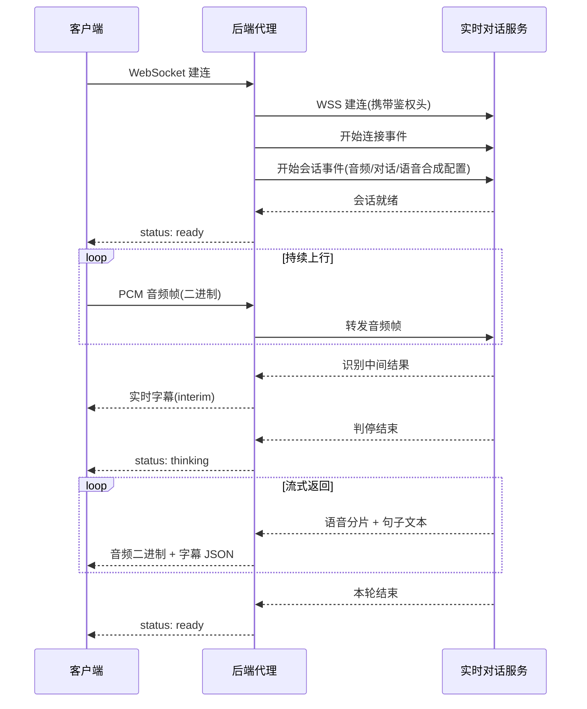
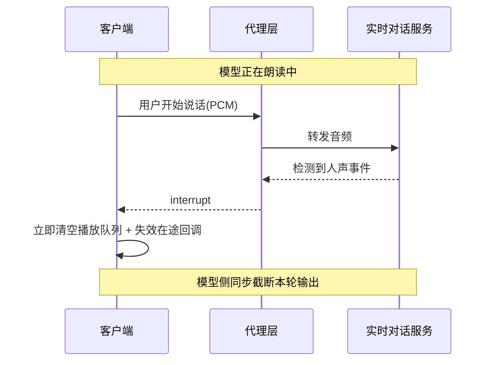

# 端到端实时语音对话技术方案

> 面向「语音进、语音出」的低延迟对话场景,记录一套经实践验证的架构选型与工程要点。
> 内容为技术实现层面的抽象总结,不含具体业务信息。

---

## 1. 方案定位

### 1.1 三条技术路线对比

| 路线 | 链路构成 | 端到端延迟 | 可否打断 | 主要问题 |
|------|----------|-----------|---------|---------|
| 三段式拼接 | ASR → LLM → TTS 串行调用 | 2 ~ 5s | 否 | 延迟逐段叠加,首字等待久 |
| 半双工流式 | 流式 ASR → LLM → 流式 TTS | 1 ~ 3s | 弱 | 首字快了,但朗读中无法插话 |
| **端到端语音对话** | 单一模型,语音进语音出 | 300 ~ 800ms | 是 | 对传输与音频管线要求高 |

选型结论:**追求拟人化通话体验时,应选端到端路线**。它把 ASR、对话理解、语音合成收敛到一个模型的一次会话里,省掉了三段之间的序列化与等待,是打通「可打断」这一体验的前提。

### 1.2 适用与不适用

**适用**
- 强交互、追求拟人感的语音助手 / 陪练 / 客服场景
- 需要用户随时插话打断的连续对话
- 对首字延迟敏感(目标 < 1s)

**不适用**
- 需要精确控制中间结果(如必须拿到逐字 ASR 文本做业务判断)
- 只需单向播报(此时单向流式 TTS 更简单、更省成本)
- 端侧算力受限、无法稳定维持长连接的弱网环境

---

## 2. 总体架构

采用三层结构,**后端必须作为代理层存在**。

```
┌──────────────┐        ┌──────────────┐        ┌──────────────┐
│ 客户端        │        │ 后端代理层     │        │ 实时对话服务   │
│              │        │              │        │              │
│ 音频采集      │  WS    │ 协议编解码     │  WSS   │ 流式 ASR      │
│ 数据收发      │ ─────► │ 会话状态管理   │ ─────► │ 对话模型       │
│ 音频播放      │ ◄───── │ 首帧缓冲      │ ◄───── │ 流式 TTS      │
│ 字幕渲染      │        │ 鉴权与限流     │        │              │
└──────────────┘        └──────────────┘        └──────────────┘
      二进制 PCM              二进制协议帧                供应商私有协议
      + JSON 事件             + JSON 事件
```

### 2.1 为什么必须加代理层

| 原因 | 说明 |
|------|------|
| **密钥隔离** | 服务商的鉴权参数绝不能下发到浏览器。客户端只连业务后端,由后端持密钥出网。 |
| **协议屏蔽** | 供应商的二进制协议可随时升级,把编解码收敛在后端,客户端只面对稳定的自定义事件格式。 |
| **可观测与限流** | 令牌消耗、并发会话数、异常率都需要在后端落点统计。 |
| **能力扩展** | 后续要接入风控、会话留痕、内容审核时,代理层是唯一合适的切面。 |

### 2.2 客户端职责边界

客户端**只做三件事**:采音频、发二进制帧、播二进制帧。所有业务语义(状态机推进、字幕拼装)可在客户端做,但**不应接触任何供应商协议细节**。

---

## 3. 音频采集与编码

### 3.1 采集参数

```js
const stream = await navigator.mediaDevices.getUserMedia({
  audio: {
    channelCount: 1,
    echoCancellation: true,   // 必开:否则扬声器输出会被麦克风回采,导致模型自问自答
    noiseSuppression: true,
    autoGainControl: true,
  },
});
```

**回声消除必须开启**。实时语音场景下若被回采,模型会听到自己的声音并持续回应,形成死循环。

### 3.2 重采样

多数服务商要求 16kHz 单声道 PCM。浏览器实际采样率通常为 44.1k / 48k,需降采样。

```js
function resampleToInt16(buffer, fromRate, toRate = 16000) {
  if (fromRate === toRate) return floatToInt16(buffer);

  const ratio = fromRate / toRate;
  const outLen = Math.floor(buffer.length / ratio);
  const out = new Int16Array(outLen);

  for (let i = 0; i < outLen; i++) {
    const src = i * ratio;
    const lo = Math.floor(src);
    const hi = Math.min(lo + 1, buffer.length - 1);
    const frac = src - lo;
    // 线性插值
    out[i] = clampToInt16(buffer[lo] * (1 - frac) + buffer[hi] * frac);
  }
  return out;
}
```

> **优先尝试原生 16kHz**:创建 `AudioContext({ sampleRate: 16000 })`,成功则免去重采样开销;失败再回退默认采样率 + 手工重采样。

### 3.3 分帧

| 参数 | 取值 | 说明 |
|------|------|------|
| 缓冲区大小 | 2048 samples | @16kHz ≈ 128ms |
| 帧类型 | Int16 PCM | 小端,单声道 |

128ms 是延迟与开销的平衡点。过小会放大网络包频率,过大则打断响应变迟钝。

### 3.4 采样率不对称问题

**上行与下行的采样率往往不同**:

| 方向 | 格式 | 采样率 |
|------|------|--------|
| 上行(客户端 → 模型) | PCM Int16 单声道 | 16kHz |
| 下行(模型 → 客户端) | PCM Int16 单声道 | 24kHz |

两者必须**各自使用独立的 AudioContext**,不能复用:

```js
const captureCtx = new AudioContext({ sampleRate: 16000 });  // 采集
const playbackCtx = new AudioContext({ sampleRate: 24000 });  // 播放
```

这是最容易踩的坑之一——复用上下文会导致播放变速变调。

---

## 4. 传输协议

### 4.1 帧类型分工

单个 WebSocket 连接内混跑两类帧:

| 帧类型 | 承载内容 | 用途 |
|--------|---------|------|
| **Text** | JSON | 控制指令、状态通知、字幕 |
| **Binary** | PCM 裸数据 | 音频上行 / 下行 |

客户端必须设置 `ws.binaryType = 'arraybuffer'`,并在 `onmessage` 里按 `typeof event.data` 分流:

```js
ws.binaryType = 'arraybuffer';
ws.onmessage = (event) => {
  if (typeof event.data === 'string') {
    handleJsonEvent(JSON.parse(event.data));
  } else {
    enqueueAudio(new Int8Array(event.data));   // 音频直接入播放队列
  }
};
```

**字幕走 JSON、音频走二进制**是这套设计的关键:音频零序列化开销,字幕可读可调试。

### 4.2 供应商二进制协议(代理层内部)

以火山引擎 V3 协议为例,帧结构如下:

```
┌─────────┬─────────┬─────────┬─────────┐
│ byte 0  │ byte 1  │ byte 2  │ byte 3  │
│ ver|sz  │ type|fl │ ser|cmp │  rsvd   │
└─────────┴─────────┴─────────┴─────────┘
│            Event ID (4B, 大端)          │
│  Session Size (4B) │   Session ID       │
│  Payload Size (4B) │     Payload        │
```

字段含义:

| 字段 | 位宽 | 取值示例 | 说明 |
|------|------|---------|------|
| 版本 \| 头长 | 4b + 4b | `0x11` | 版本 1,头长 4 字(16 字节) |
| 消息类型 \| 标志位 | 4b + 4b | `0x14` / `0x24` | FullClientRequest+Event / AudioOnly+Event |
| 序列化 \| 压缩 | 4b + 4b | `0x10` / `0x00` | JSON+无压缩 / 无序列化 |
| 保留位 | 8b | `0x00` | 固定 |

**编解码要点**
- 所有整数为**大端 4 字节**,用 `ByteBuffer.putInt()` 而非 `put()`
- Session ID 段仅当 `eventId >= 100` 时才存在,解析时须先判事件号
- 压缩位若为 GZIP,payload 需先解压再解析 JSON
- **下行可能分片**:服务端不保证一帧一个完整消息,解析器必须维护缓冲区累积,凑齐 `Payload Size` 再处理

下行分片累积的核心逻辑:

```java
buffer.write(incoming);
while (buffer.size() >= 4) {
    if (!headerParsed) {
        expectedSize = readInt(buffer, 8);
        buffer.dropFirst(12);           // 跳过帧头
        headerParsed = true;
    }
    if (headerParsed && buffer.size() >= expectedSize) {
        byte[] payload = buffer.take(expectedSize);
        headerParsed = false;
        process(payload);               // 处理完继续循环,可能还有下一帧
    } else {
        break;                          // 数据不够,等下一包
    }
}
```

### 4.3 客户端事件模型(代理层对外)

代理层把供应商事件翻译成**稳定、语义化的自定义事件**,屏蔽实现细节:

| 事件 | 触发时机 | 客户端动作 |
|------|---------|-----------|
| `status: connecting/ready/thinking/closed` | 会话状态变化 | 更新 UI 状态 |
| `asr` (含 `interim`) | 识别出用户说的话 | 渲染实时字幕 |
| `interrupt` | 检测到用户开始说话 | **立即停止播放** |
| `teacher` (含 `event`) | 模型回答文本 | 拼装字幕 |
| `error` | 各类失败 | 展示错误、重连 |

事件映射建议集中在**单一 switch 里**,便于对照供应商文档维护。

---

## 5. 会话生命周期

### 5.1 状态机



### 5.2 握手时序



### 5.3 首帧音频缓冲(关键设计)

**问题**:客户端一连上就立即推送音频,但代理层到服务商的连接往往还没就绪,这段时间的音频会被直接丢弃——表现为**开头第一个字听不见**。

**解法**:代理层为每个客户端会话维护一个待发缓冲区。

```java
// 收到客户端音频时
if (upstreamReady && session != null) {
    session.sendAudio(pcm);              // 通路已就绪,直接转发
} else {
    synchronized (buffer) { buffer.add(pcm); }   // 先攒着
}

// 收到 upstream 就绪事件时
private void flushBufferedAudio(SessionState state) {
    List<byte[]> pending;
    synchronized (state.buffer) {
        pending = new ArrayList<>(state.buffer);
        state.buffer.clear();
    }
    if (state.session == null) return;   // 此时 session 必须已赋值
    for (byte[] audio : pending) state.session.sendAudio(audio);
}
```

**两个必须注意的竞态**:
1. `session` 对象的赋值与 `ready` 标志的到达顺序不确定,flush 前必须二次判空
2. 建连在异步线程完成,`ready` 事件可能在 `session` 赋值前就到达——所以**两处都要调用 flush**,用幂等逻辑兜底

---

## 6. 下行音频播放

### 6.1 队列播放模型

下行音频是**分片到达**的,不能用单个 AudioBuffer 一次播完。标准做法是维护播放队列:

```js
function playNext() {
  if (queue.length === 0) {
    playing = false;
    return;                       // 队列空,本轮结束
  }
  playing = true;

  const data = queue.shift();
  const buffer = ctx.createBuffer(1, data.length, 24000);
  const ch = buffer.getChannelData(0);
  for (let i = 0; i < data.length; i++) {
    ch[i] = data[i] / 32768.0;    // Int16 → Float32
  }

  const source = ctx.createBufferSource();
  source.buffer = buffer;
  source.connect(ctx.destination);
  source.onended = () => playNext();   // 播完自动接下一片
  source.start();
}

function enqueue(pcm) {
  queue.push(pcm);
  if (!playing) playNext();
}
```

**优势**:`onended` 链式驱动天然实现无缝衔接,无需手工计算播放时刻表,也不会有 `setTimeout` 带来的累积漂移。

### 6.2 播放进度追踪(可选)

若 UI 需要进度条,用 `requestAnimationFrame` 轮询 `ctx.currentTime` 而非 `setTimeout`:

```js
const elapsed = (ctx.currentTime - sourceStartTime) * 1000;
const current = playedBefore + Math.min(elapsed, sourceDuration);
```

`playedBefore` 累积已播完分片的时长,`sourceDuration` 为当前分片时长。

---

## 7. 打断机制(barge-in)

这是端到端方案区别于三段式方案的核心体验,也是**最容易做错的地方**。

### 7.1 触发链路



### 7.2 客户端处理

```js
function interrupt() {
  playToken++;              // 关键:令牌递增,让所有在途 onended 失效
  stopProgress();
  queue = [];               // 清空未播分片
  ctx?.close();             // 直接关闭音频上下文,而非等待自然结束
  ctx = null;
  playing = false;
  playedBefore = 0;
}
```

**为什么必须用令牌失效**:`AudioBufferSourceNode` 的 `onended` 回调在 `stop()` 或 `close()` 后可能仍被触发一次。若不校验令牌,回调会去拉取已被清空的队列并**重新启动播放管线**,出现"打断后又冒出一句"的 bug。

```js
source.onended = () => {
  if (token !== currentToken) return;   // 令牌不匹配,说明已被打断
  playNext();
};
```

### 7.3 服务侧配合

客户端清空本地队列只是一半,还必须让**模型停止生成**,否则它会继续算完、继续下发。需要在会话配置中启用:

| 配置 | 作用 |
|------|------|
| `enable_conversation_truncate` | 允许对话轮次被截断 |
| `input_mod: keep_alive` | 保持长连接不因打断而断开 |
| 人声检测事件 | 服务侧主动上报"用户开始说话",用于触发客户端打断 |

**双侧联动**才能做到"用户一开口,声音立刻停"。

---

## 8. 字幕链路

### 8.1 双源字幕的合并问题

字幕有两个数据源,内容会重叠:

| 来源 | 特性 |
|------|------|
| 句子级事件(逐句下发) | 增量片段,实时性好,但会重复推送 |
| 完整回答事件 | 一次性给全量文本,可能与已累积内容重复 |

直接拼接会出现叠字。**解法是归一化后判重**:

```js
function mergeText(current, incoming, eventId) {
  if (!current) return incoming;

  const a = normalize(current);
  const b = normalize(incoming);

  // 完全相同 / 已被包含 → 丢弃
  if (!b || a === b || a.includes(b)) return current;

  // 全量事件且是累积内容的超集 → 整体替换
  if (isFullEvent(eventId) && (incoming.startsWith(current) || b.includes(a))) {
    return incoming;
  }

  return current + incoming;
}

// 去掉空白与全部标点再比较
function normalize(s) {
  return s.replace(/\s+/g, '').replace(/[，,。.!！?？；;：:、"'“”‘’（）()《》<>]/g, '');
}
```

### 8.2 字幕清理时机

在以下时点必须清空字幕缓冲,否则会串轮次:

- 用户开始说话时(新一轮开始)
- 状态切到"思考中"时
- 主动打断时

---

## 9. 容错与可观测

### 9.1 连接超时

建连必须设超时,否则 UI 会永久卡在"连接中":

```js
setTimeout(() => {
  if (stillConnecting) rejectReady(new Error('连接超时'));
}, 20000);
```

后端侧同理,用 `CountDownLatch.await(10, SECONDS)` 而非无限等待。

### 9.2 常见失败与处置

| 场景 | 表现 | 处置 |
|------|------|------|
| 麦克风权限被拒 | `NotAllowedError` | 明确提示去浏览器设置开启,不要泛化成"录音失败" |
| 配置缺失 | 建连即抛异常 | 启动时校验必填配置,快速失败 |
| 会话失败 / 对话错误 | 收到错误事件 | 展示可读错误,关闭会话并可重连 |
| 上行分片不完整 | 解析异常 | 解析层捕获并跳过单帧,不能整个连接崩掉 |
| 网络抖动 | `onclose` 触发 | 通知客户端状态,由客户端决定是否重建会话 |

### 9.3 建议埋点

- 会话建立耗时(客户端建连 → 收到 ready)
- 首字延迟(用户停止说话 → 首片音频到达)
- 打断响应耗时(interrupt 事件 → 音频真正停止)
- 会话时长 / 异常率

这三个延迟指标直接决定体验,必须可测量。

---

## 10. 关键参数速查

| 参数 | 建议值 | 说明 |
|------|--------|------|
| 上行采样率 | 16kHz | 服务商常规要求 |
| 下行采样率 | 24kHz | 与上行不同,注意独立上下文 |
| 采集缓冲区 | 2048 samples | ≈128ms |
| 静音判停窗口 | 800 ~ 1000ms | 过短会截断用户说话,过长则响应迟钝 |
| 语音语速 | 略快于默认 | 实时对谈场景下过慢会显得拖沓 |
| 响度归一化 | 开启 | 避免不同句子音量忽大忽小 |
| 建连超时 | 10 ~ 20s | 前后端都要设 |
| 播放队列上限 | 建议限长 | 防极端情况下内存堆积 |

### 10.1 提示词层面的约束

实时语音场景的提示词与文本对话**要求完全不同**:

- **限制回答长度**:1~2 句话。长回答在语音场景下用户等不下去
- **口语化、适合朗读**:避免生僻长句、避免书面的层级化表达
- **禁止拟声词与网络用语**:朗读出来会非常突兀
- **首轮不要自我介绍**:每次都说一遍会让人烦
- **话题越界时温和拉回**:不要生硬拒答

### 10.2 识别优化

- **领域热词注入**:在会话配置里传入本领域的专有名词列表,显著提升专有名词识别率
- **双遍识别**:开启 `enable_asr_twopass` 之类选项,首遍求快、二遍求准
- **静音窗口调优**:根据用户平均语速调整,宁可稍长也不要截断

---

## 11. 落地检查清单

**架构**
- [ ] 鉴权参数只存在于后端,客户端零接触
- [ ] 供应商协议编解码全部收敛在代理层
- [ ] 客户端事件模型与供应商事件解耦

**音频**
- [ ] 采集端开启回声消除、降噪、自动增益
- [ ] 采集与播放使用独立 AudioContext(采样率可能不同)
- [ ] 握手期音频有缓冲,就绪后 flush
- [ ] 播放队列在结束时正确置空状态

**交互**
- [ ] 打断时:清队列 + 令牌失效 + 关闭上下文,三者齐全
- [ ] 打断时同时通知服务侧截断,不能只停本地
- [ ] 字幕去重归一化,避免叠字
- [ ] 字幕在轮次切换时清空

**健壮性**
- [ ] 建连超时(前后端都有)
- [ ] 下行分片累积解析,不假设一帧一消息
- [ ] 解析异常只丢单帧,不断连
- [ ] 错误信息对用户可读(权限类错误单独提示)

**可观测**
- [ ] 建连耗时、首字延迟、打断响应耗时三项埋点

---

## 附:何时退回三段式

端到端方案并非银弹。以下情况建议退回三段式拼接:

| 情况 | 原因 |
|------|------|
| 需要对中间文本做业务判断 | 端到端不暴露可控的中间结果 |
| 只需单向播报 | 单向流式 TTS 成本更低、实现更简单 |
| 需要多轮长上下文精确控制 | 三段式对历史消息管理更可控 |
| 供应商配额受限 | 端到端单价通常更高 |

两个方案可以并存,共用同一套提示词与音色配置,按页面按需选用。
